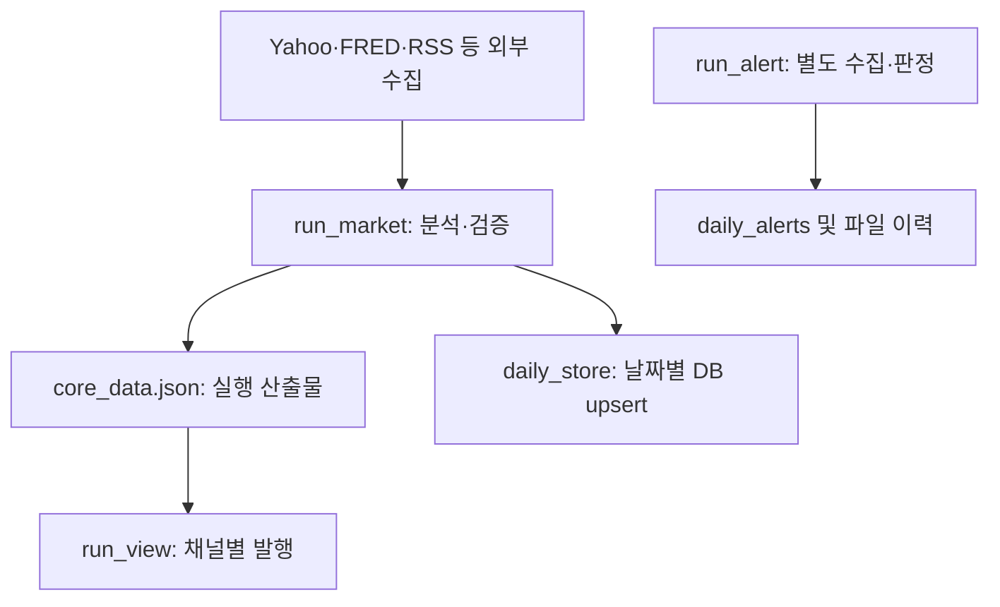

# Investment OS main 파이프라인 고도화 요구사항 정의서 v0.1

기준: 코드 `main` 2c3f6f7, Supabase 프로젝트 `ccomoimhhttaklfadaos`의 2026-09-28 KST 읽기 전용 조회. 상태: 요구사항 초안. 실제 이해관계자 인터뷰·합의 및 운영 DB 변경은 수행하지 않았다. 아래 5개 역할의 논의는 **역할별 검토 시뮬레이션**이다.

## 1. 운영 데이터 확인 결과

| 대상 | 조회 결과 | 코드와의 교차 대조 | 판단 |
|---|---|---|---|
| `daily_snapshots`, `daily_analysis`, `daily_news` | 각 135건, 2026-04-03~09-28; 날짜 조인 누락 0 | `db/daily_store.py`의 KST 날짜별 별도 upsert | 날짜별 저장은 수행됨. 실제 시장 거래일과 `snapshot_date` 일치는 별도 검증 필요 |
| `daily_snapshots` | VIX, SPY, F&G NULL 각 0/135; PCR 및 PCR source NULL 135/135; 주말 날짜 8건 | `run_market.py`는 PCR 수집; `store_daily_snapshot`은 PCR 필드를 row에 넣지 않음 | PCR 결과가 DB까지 전달되지 않음. 주말 날짜는 KST 기준 저장일이므로 곧바로 휴장일 오발행 증거는 아님 |
| `daily_analysis` | `trading_signal='HOLD'` 135/135; `etf_rank`, `etf_allocation`, `market_score` JSONB 타입 모두 `string` 135/135 | risk engine 반환 키는 `trading_signal`, 저장 코드는 `.get('signal','HOLD')`; `json.dumps`를 JSONB 필드에 보냄 | 시그널 저장 매핑 오류 **코드상 확정**. JSONB 이중 직렬화도 확정. 과거 실제 시그널 값은 별도 원본 없이는 복원 불가 |
| `daily_news` | RSS headline_count=0 및 Neutral 각 135/135. `top_headlines` JSONB 타입 `string` 135/135 | 저장 코드는 `data.news_summary`의 `headline_count`, `sentiment`를 조회하지만 수집 결과 `rss_result`의 건수·감성은 이용하지 않음; `top_headlines`도 `json.dumps` | RSS 메타데이터 매핑 오류. 헤드라인 본문은 저장되어 있으므로 뉴스 수집 전체 실패로 단정 불가 |
| `daily_alerts` | 36건, 2026-04-03~09-18, 전부 OIL/L2, tweet_id 누락 0 | `run_alert.py`가 감지·발송 후 기록 | 다른 Alert 유형의 미발생, 감지 실패, 저장 누락은 이 테이블만으로 구분 불가 |
| `os_alert_history` | 0건 | `core/alert_state_backend.py`는 기본 `file`; `dual/supabase`에서만 DB 기록 | 현재 실제 환경 변수값 미확인. 0건만으로 모드가 file이라고 확정할 수 없음 |
| `ia_alert_history` | 163건 (2026-04-25~09-16) | `investment-alert`용 별도 도메인 테이블 | main Alert의 이력으로 섞거나 병합하면 안 됨 |

### 운영 DB 보안 사실

`daily_snapshots`, `daily_analysis`, `daily_news`, `daily_alerts`, `os_alert_history`는 모두 RLS가 비활성이고, `anon` 및 `authenticated`에 SELECT/INSERT/UPDATE/DELETE/TRUNCATE 등 권한이 부여되어 있다. Supabase의 진단에는 public 28개 테이블에서 RLS가 꺼져 있다고 나온다. 접근 가능한 API 설정 및 사용 중인 키를 함께 점검해야 하며, 즉시 RLS만 켜면 기존 쓰기 경로가 막힐 수 있으므로 현 DB에는 어떤 수정도 하지 않았다. 이를 P0 별도 작업으로 관리한다.

## 2. 운영 데이터 계보와 신뢰 경계



DB의 `created_at`은 적재 시각이고 시세 관측 시각이 아니다. 최근 2026-09-28 날짜 3개 테이블의 `created_at`은 2026-09-27 23:58 UTC 전후(KST 09-28 08:58)다. `daily_*`의 날짜 컬럼은 코드가 적재 당시 KST 날짜로 생성하며, 원본 미국 시장 거래일을 별도로 기록하지 않는다. 과거 시점의 데이터가 어느 시장 세션을 나타내는지 날짜 컬럼만으로 검증할 수 없다.

## 3. 5개 이해관계자 역할별 검토

실제 5명이 토론한 기록이 아니다. 다음은 서로 다른 실무 역할의 관점에서 제기될 질문과 코드·DB 증거를 대조해 내린 제안이다.

| 역할 | 제기한 쟁점 | 근거 | 합의안 초안 |
|---|---|---|---|
| 시장 데이터 담당 | DB가 잘못 저장한 값으로 후속 판단·콘텐츠를 재구성하면 오류가 전파된다 | `trading_signal` 135/135 HOLD, RSS 135/135 0·Neutral, JSONB string | 기존 135건을 진실 데이터로 소급 사용하지 않음. 매핑 수정 후 실행 원본과 대조하고 변경 전후에 provenance 표시 |
| 백엔드 아키텍트 | 캐시 이력과 채널별 발행의 선점은 거래 단위가 아니다 | cache restore/save, `record_published` 호출 시점, DB 유일 키 부재 | 실행 스냅샷과 publication·attempt 장부 분리, 원자적 선점 및 UNKNOWN 대조 절차 |
| 운영/SRE | Actions 성공이 X·TG·Alert 개별 성공을 뜻하지 않는다 | Telegram 결과 무집계, `main.py alert` 종료 코드, `os_alert_history` 0건 | 채널별 성공·부분 실패·스킵 대시보드, 미실행 탐지, 재처리와 수동 확인 큐 |
| 콘텐츠/채널 운영 | preview 중에도 Telegram이 실전송되면 검증이 곧 게시 사고가 된다 | `telegram_publisher.py`의 DRY_RUN 무관 전송 | 전 채널 preview 금지 게이트와 테스트 채널 분리, live 수정 발행은 edition·사유 기록 |
| 보안/감사 담당 | 공개 스키마의 상태 테이블 권한은 무단 읽기·변경 가능성을 열어 둔다 | RLS off 및 anon/authenticated 쓰기 권한 조회 | 실 사용 주체 조사→서버 전용 권한 설계→단계적 RLS/GRANT 조정→회귀 확인. 운영 승인 전 직접 변경 금지 |

논의의 결론은 **저장된 값의 의미를 바로잡고, 발행 상태의 단일 기준을 만들며, 전송 자격과 운영 권한을 분리**하는 것이다. 성능 개선보다 데이터 정확성·중복 방지·접근 통제를 선행한다.

## 4. 요구사항 목록

우선순위: P0=데이터 왜곡·실발행·접근 통제, P1=운영 복구, P2=구조 최적화. `AC`는 검증 가능한 완료 기준이다.

| ID | 우선순위 | 요구사항 | 수용 기준(AC) | 현재 근거/대상 |
|---|---|---|---|---|
| DATA-01 | P0 | `daily_analysis.trading_signal`을 `data.trading_signal.trading_signal`에서 읽는다 | 서로 다른 BUY/HOLD/HEDGE 등 fixture에 대해 DB 적재 값이 `core_data`와 일치; 누락 시 기본 HOLD로 조용히 대체하지 않고 품질 오류 | `db/daily_store.py:store_daily_analysis` |
| DATA-02 | P0 | RSS 건수·감성을 `rss_result.total_headlines`, `rss_result.news_sentiment`, `rss_result.sentiment_score`에서 매핑한다 | 헤드라인 3건·감성 Bullish 입력이면 DB count=3, 감성=해당 값; 0건은 `collection_status`로 구분 | `store_daily_news` 및 `collect_news_sentiment` |
| DATA-03 | P0 | JSONB에 Python dict/list를 보관한다 | `jsonb_typeof(etf_rank/etf_allocation/market_score/top_headlines)='object/object/object/array'`; 기존 string 135건은 백업·검증 후 별도 데이터 정정 계획 | `json.dumps` 후 upsert |
| DATA-04 | P1 | PCR 등 수집→분석→DB 각 필드의 매핑표와 선택적 지표 정책 수립 | PCR 수집 성공 fixture에서 DB 저장; 실패면 NULL+상태·원인 표시, 허위 0 금지 | PCR 135/135 NULL |
| DATA-05 | P0 | `target_market_date`, `source_as_of`, KST 적재일을 분리 | 각 세션·DST·휴장 fixture에서 대상 거래일 일치; stale 입력은 실발행 차단 | 주말 KST 날짜 8건, 관측시각 미저장 |
| DATA-06 | P1 | 3개 일별 테이블의 부분 성공을 추적하고 재처리한다 | 하나의 upsert만 실패해도 run 상태 PARTIAL_FAILED, 실패 테이블 재적재 가능 | 현재 개별 예외 무시·3개 호출 |
| PUB-01 | P0 | 채널·대상·역할·순번 단위 발행 장부와 유일 키 | 동시 두 실행에서 동일 대상 선점 최대 1건; 내용 변경은 새 edition 승인 필요 | `docs/main_pipeline_v2_detailed_design.md` |
| PUB-02 | P0 | X 스레드 및 Telegram 수신자별 부분 성공 보존 | 2번째 X 게시 실패 시 첫 외부 ID 보존; free 성공/paid 실패 시 paid만 재처리 | `run_view.py`, `publish_thread()` |
| PUB-03 | P0 | 결과 불명확한 API 타임아웃은 UNKNOWN으로 둔다 | 조회/운영 판정 전 자동 재전송 0회; 판정 시각·근거 기록 | 외부 전송↔DB 기록 사이 크래시 |
| PUB-04 | P0 | preview가 X·TG·랭킹·부가 콘텐츠 및 DLQ 전송을 모두 차단 | preview 통합 테스트에서 모든 게시 API 호출 0회; 실발행 이력 점유 0건 | 현재 DRY_RUN TG 실전송 |
| ALERT-01 | P1 | main Alert, `daily_alerts`, `os_alert_history`, 별도 `ia_*`의 범위 구분 | 4개 계보 명시, Alert 유형별 감지/필터/전송/저장 건수 대조 | OIL/L2 36건, os_alert_history 0건 |
| ALERT-02 | P1 | Alert의 부분 실패·윈도 밖·휴장 스킵을 종료 코드와 운영 지표로 분리 | 감지는 됐지만 외부 전송 실패 시 성공 종료 금지; 이유별 결과 및 알림 | `main.py alert` |
| OPS-01 | P1 | cron 매핑, 실제 시작 지연, 미실행, 데이터 신선도를 감시 | 예정 실행 누락/지연/오래된 source를 분리하여 알림; KST/ET 경계 테스트 | `main.yml` 수동 cron/if 중복 |
| OPS-02 | P1 | 파일 캐시 상태를 DB 기준 장부로 점진 이관 | dual 대조 기간에 상태 불일치 로그 및 복구; 완료 후 DLQ·이력 캐시 제거 | `history.json`, `dlq.json` 등 |
| SEC-01 | P0 | public 테이블의 접근 범위와 RLS/GRANT를 실제 운영 주체에 맞게 제한 | anon/authenticated 무인가 DML 거부, 서버 작업 정상, RLS advisor 점검; 단계별 롤백 검증 | public 28개 RLS off 진단 |
| SEC-02 | P1 | 서비스 키/게시 토큰을 작업별 최소 범위로 제공 | PR 검증 잡 발행 자격 증명 접근 불가, 게시 잡에만 전달, 로그 노출 0건 | `main.yml` workflow-wide secrets env |
| TEST-01 | P0 | 매핑·상태·장애 시나리오 회귀 검증 | DATA-01~03, PUB-01~04, preview, 휴장/DST, DB 단절 테스트 통과; 기존 계산식 출력 동등 | 실행 전 테스트 게이트 |

## 5. 수리·이관 순서

1. **P0 사실확인:** 최신 `core_data.json` 실제 원본과 DB 같은 날짜 행 비교; RSS dict 키, 시그널 키, PCR 계약을 테스트로 고정한다. 운영 GitHub secret 값은 노출하지 않고 활성 모드만 안전하게 확인한다.
2. **P0 데이터 저장 수정:** 매핑/JSONB 타입을 신규 적재분부터 수정. 과거 135건은 원본 artifact와 대조 가능한 날짜만 정정하고, 원본이 없는 날은 추정값으로 채우지 않는다.
3. **P0 보안 준비:** 사용 중인 API 키의 권한, 소비자, RLS 정책과 서버 접근 경로를 인벤토리화한다. 이 단계에서는 기존 읽기/쓰기 경로의 영향 분석 없이 RLS를 일괄 활성화하지 않는다.
4. **P0 발행 게이트:** preview 통합→신규 DB 장부 shadow→한 채널씩 원자적 선점 전환. X 응답 유실 시 UNKNOWN 대조 절차를 마련한다.
5. **P1 운영 전환:** Alert·DLQ·스레드 상태 이관, 채널별 대조 및 관측. 캐시 제거는 이관 성공 후 수행한다.

## 6. 확인이 필요한 운영 결정

* 세션별 미국 시장 대상일 정의와 데이터 관측 시각 허용 한계.
* 실 사용 DB key 종류, 공개 API 사용 여부, RLS 적용 순서 및 롤백 책임자.
* 기존 DRY_RUN Telegram 실전송이 운영상 의도된 사용인지.
* X/Telegram 결과 불명확 시 조회 가능 범위와 수동 판정 담당자.
* 선택 채널 실패를 Actions 실패로 처리할지, PARTIAL_FAILED 경보로 처리할지.

운영 DB에 대한 조회는 모두 SELECT/메타데이터 조회였으며 데이터 수정·DDL·정책 적용은 없었다.

### 보안 변경 검토용 SQL 예시 — 실행 금지, 접근 주체 확인 후 별도 마이그레이션

```sql
-- 다음 명령만 단독으로 적용하면 기존 anon/authenticated 클라이언트가 중단될 수 있다.
-- 서버 작업이 어느 DB role/key로 수행되는지 확인하고 테스트 환경에서 먼저 검증한다.
ALTER TABLE public.daily_snapshots ENABLE ROW LEVEL SECURITY;
ALTER TABLE public.daily_analysis ENABLE ROW LEVEL SECURITY;
ALTER TABLE public.daily_news ENABLE ROW LEVEL SECURITY;
ALTER TABLE public.daily_alerts ENABLE ROW LEVEL SECURITY;
ALTER TABLE public.os_alert_history ENABLE ROW LEVEL SECURITY;

REVOKE ALL ON public.daily_snapshots, public.daily_analysis,
  public.daily_news, public.daily_alerts, public.os_alert_history
  FROM anon, authenticated;
-- API를 사용하는 승인된 클라이언트가 있으면 그 주체에 필요한 최소 권한과
-- 행 단위 정책을 별도 설계한다. 나머지 23개 RLS 비활성 테이블도 별도 조사 대상.
```
