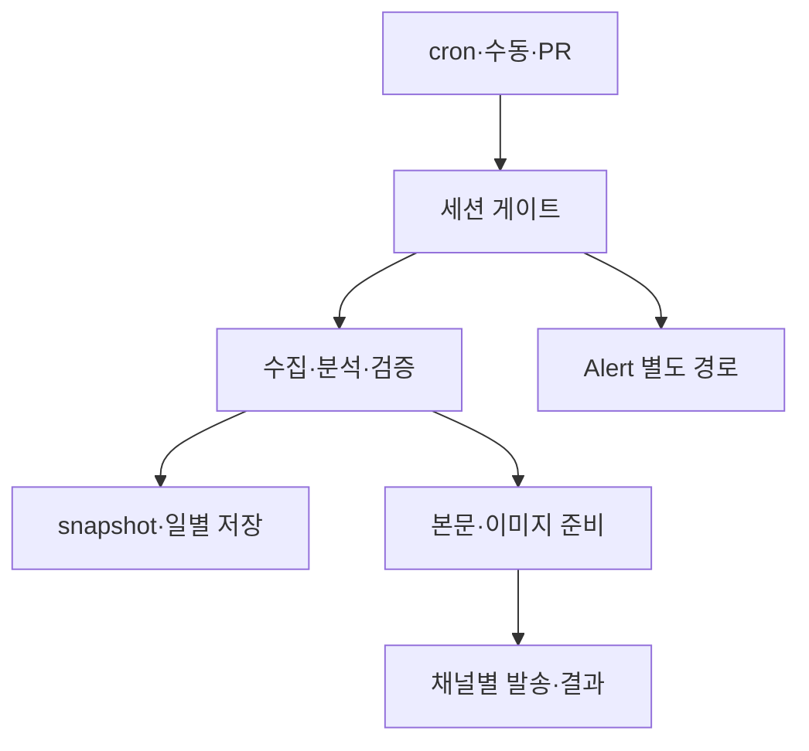

# Investment OS main 파이프라인 프로세스 설계서 v1.0

기준: `design/main-pipeline-v2` (2026-09-28 KST). **현행 운영 흐름과 목표 설계를 구분한다.** 요구사항 정본은 `main_pipeline_v2_requirements.md`, 상세 상태·DDL 초안은 `main_pipeline_v2_detailed_design.md`를 참조한다.

Notion 정본: [프로세스 설계서](https://app.notion.com/p/3e99208cbdc38190a8d7d6c0de7b34a9)

## 1. 범위와 책임

| 구간 | 현행 구현 | 목표 계약·상태 |
| --- | --- | --- |
| 트리거 | UTC cron, 수동 `workflow_dispatch`, push/PR 파일럿 | 예정 시각·실제 시작 시각·세션·거래 대상일 기록 |
| 수집·분석 | `main.py` → `run_market.run()` → 분석·검증 → `core_data.json` | 소스 관측 시각과 품질 상태를 명시하고 유효성 실패 시 발행 차단 |
| 일별 저장 | `db/daily_store.py`에서 KST 날짜별 3개 upsert. 신규 적재 DATA-01~03 매핑 수정 완료 | 개별 저장 실패를 PARTIAL_FAILED로 집계, 날짜별 재처리 기준 추가 |
| 발행 | `run_view.run()`이 X·Telegram·부가 게시를 순차 실행, 파일 이력 사용 | 채널·대상·순번별 publication/attempt 장부와 원자적 선점 |
| Alert | `main.py alert` → `run_alert.run()` 별도 수집·윈도 판정·발송 | 실패·스킵·UNKNOWN을 구분하는 종료 코드와 관측 |

## 2. 현행 실행 시간과 게이트

| 세션 | 트리거 | Python | 비고 |
| --- | --- | --- | --- |
| morning | UTC `36 21 * * 0-4` = KST 월~금 06:36 | `main.py run all --session morning --mode tweet` | `core_data`, 이력·DLQ 등 캐시 복원/저장 |
| narrative | UTC `36 2 * * 1-5` = KST 월~금 11:36 | `run all --session narrative` | 이미지·발행 기록 사용 |
| full | UTC `36 9 * * 1-5` = KST 월~금 18:36 | `run all --session full` | `full_dashboard` job |
| alert | UTC `*/10 13-14 * * 1-5`, `*/10 15-21 * * 0-4` | `main.py alert` | ET 윈도 09:30~15:30, grace 20분; DST 및 휴장 판정 별도 |
| intraday·close·weekly | 수동 dispatch만 | `run all`, 해당 세션 | cron 비활성; weekly_thread job 조건 유지 |
| pilot_test | main push/PR | `main.py test --round all` 및 pytest 4개 파일 | 외부 API 없는 fixture 테스트, Python 3.11 |

workflow의 job `if`는 cron 문자열과 정확히 일치해야 한다. 스케줄은 지연·누락될 수 있으므로 예정 실행과 실제 실행을 별도 관측한다. `notify_watchdog.yml`은 시작된 워크플로의 실패만 포착하고 미시작 cron은 탐지하지 못한다.

## 3. 데이터 계약과 경계

`data.trading_signal.trading_signal` → `daily_analysis.trading_signal`; `rss_result.news_sentiment`, `sentiment_score`, `total_headlines` → `daily_news`; ETF·점수·뉴스 목록은 JSONB 객체·배열로 전달한다. 신규 저장만 수정됐고 과거 135건은 자동 정정되지 않았다. `daily_snapshots`는 `prediction_league.yml` 퀴즈가 읽으므로 날짜·신선도 변경 전에 해당 소비자 계약을 함께 검증한다.

현재 DB 날짜는 KST 적재일이며 미국 거래일 또는 소스 관측 시각의 증거가 아니다. 목표 필드는 `target_market_date`, `source_as_of`, `observed_at`이고, 소급 채움은 원본이 확인된 건으로 제한한다. PCR NULL과 전체 RSS 수집 실패를 유효한 0건과 구분하는 상태는 후속 설계다.

## 4. 목표 상태 전이와 예외

| 상태 | 진입 조건 | 다음 처리 |
| --- | --- | --- |
| STARTED → COLLECTED → VALIDATED | 수집·검증 통과 | snapshot과 manifest 생성 |
| VALIDATED → PREPARED → DISPATCHING | 대상별 payload 준비, 원자적 선점 | 채널별 외부 ID·attempt 기록 |
| COMPLETED | 필수 대상 성공 | 결과와 시각 기록 |
| PARTIAL_FAILED / FAILED | 일부/전체 필수 대상 실패 | 성공 대상 보존, 실패분만 조사·재처리 |
| SKIPPED(reason) | 휴장·윈도 밖·정책 스킵 | 성공 발행으로 집계하지 않음 |
| UNKNOWN | 외부 요청 결과를 확인할 수 없음 | 자동 재발행 금지, 외부 결과 대조 뒤 판정 |

이 상태 장부는 **목표 설계**이며 현행 DB에 생성되지 않았다. DB 선점 불가 시 실발행을 막는 방식으로 전환하고, X 스레드 및 Telegram free/paid의 개별 결과를 보존한다. DB와 외부 API 간 exactly-once는 보장할 수 없으므로 UNKNOWN 운영 절차가 필수다.

## 5. 변경 단계와 수용 기준

1. DATA-01~03 신규 적재 계약: 구현 완료, 로컬 계약·혼합 JSON 조회 13건 및 파일럿 단독 42/42 통과. 실제 runner·운영 DB write 미검증.
2. DATA-04~06: PCR·관측 시각·거래 대상일·부분 적재 실패를 모델링하고 퀴즈 소비자 및 재처리 테스트를 추가.
3. PUB-04: 공통 X·Telegram 발행 함수의 preview 차단을 검증. 랭킹·DLQ를 포함한 전체 세션의 외부 전송 0건은 추가 통합 검증이 필요하다.
4. PUB-01~03: 별도 DB 마이그레이션과 발행 장부, 동시 선점·스레드 부분 성공·UNKNOWN 대조 테스트 후 채널별 단계 전환.
5. ALERT/OPS/SEC: Alert 파일·DB 이력 shadow 비교, 누락 cron 감시, 실제 키 소비자 조사 후 RLS/GRANT 단계적 적용.

운영 DB를 대상으로 임의 재실행하지 않는다. 날짜별 UPSERT가 기존 행을 덮을 수 있다. 자세한 테스트 한계는 `source_level_impact_review_2026_09_28.md`에 있다.
