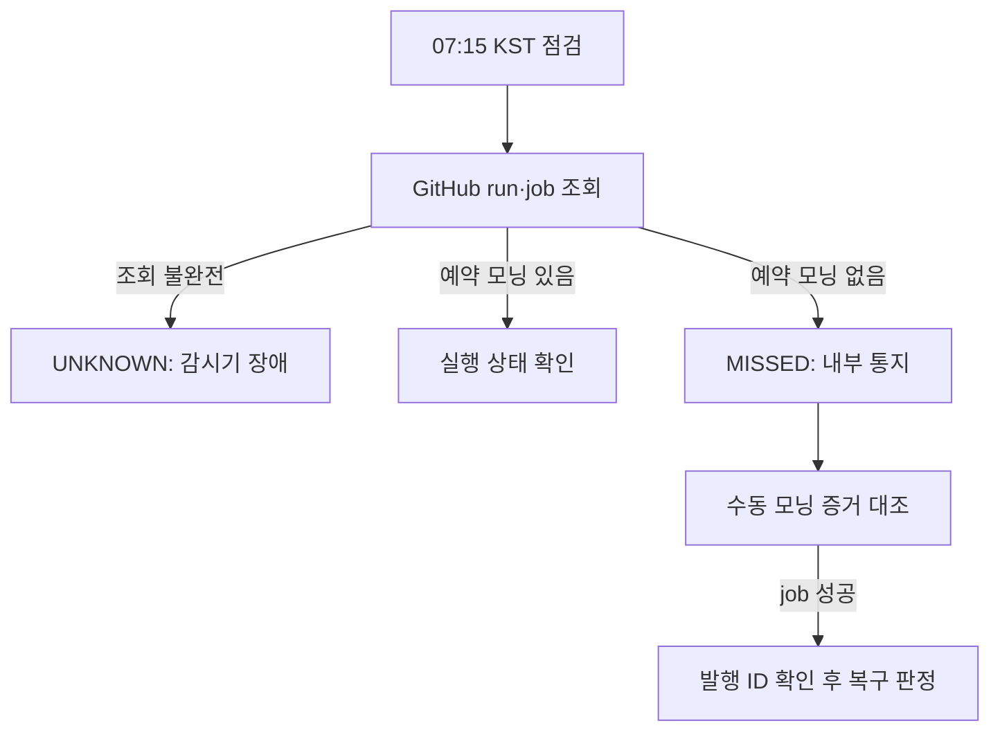

# 모닝 예약 누락 감시 상세설계 v1.0

상태: 설계 완료, 읽기 전용 shadow beta 로컬 구현, 운영 반영 전. 기준: 2026-09-29 KST의 `main.yml` 및 `notify_watchdog.yml`. 기존 `watchdog_detailed_design_2026-09-13.md`의 Phase 1을 **모닝 세션에 한정해 구체화**한다.

## 1. 문제와 범위

- `main.yml` 모닝 예약은 `36 21 * * 0-4`(UTC 일~목 21:36 = KST 월~금 06:36). 해당 job의 `if`도 동일 문자열을 비교한다.
- 9월 29일 06:36 KST 예약 모닝 run은 확인되지 않았다. 09:05 수동 모닝은 성공했고, 09:48 예약 run은 Alert Check만 실행됐다. 따라서 워크플로 전체 run의 존재/성공만으로 모닝 예약 성공을 판정하면 오탐이다.
- 기존 `notify_watchdog.yml`은 시작된 workflow의 비정상 종료만 감시하므로 예약 이벤트 미생성을 감지할 수 없다.
- 이번 단계는 **예약 모닝의 존재·지연·실패와 수동 복구 상태를 감지하고 내부 채널에 알림**까지다. 자동 dispatch, X/TG 재발행, 기존 워치독 변경, DB 정정은 포함하지 않는다.

## 2. 수용 기준

| ID | 요구 | 검증 |
| --- | --- | --- |
| MWD-01 | 기대 KST 날짜의 모닝 예약 slot을 계산 | UTC 요일 이동, 월·연도 경계 테스트 |
| MWD-02 | `schedule` run 중 **Morning Brief job** 실제 상태를 판정 | Alert만 성공한 run을 모닝 성공으로 오판하지 않음 |
| MWD-03 | 07:15 KST부터 누락을 판정, 실행 중이면 별도 지연 상태 | 06:36+39분 전에 누락 알림 없음 |
| MWD-04 | 같은 날 수동 모닝 성공을 `MANUAL_RECOVERED`로 따로 표시 | 예약 누락 이력은 보존 |
| MWD-05 | API 오류와 결과 불명은 `UNKNOWN` | 조회 실패를 `MISSED`로 바꾸지 않음 |
| MWD-06 | 동일 slot의 알림은 중복 발송 방지 | 상태 전이 및 재시도 테스트 |
| MWD-07 | 운영 게시를 자동 실행하지 않음 | 워크플로에 `actions: write`/dispatch 없음 |

## 3. 구성과 권한

| 파일/요소 | 책임 |
| --- | --- |
| `.github/workflows/morning_schedule_watchdog.yml` | KST 평일 07:15, 08:15, 09:15에 점검(`15 22 * * 0-4`, `15 23 * * 0-4`, `15 0 * * 1-5` UTC), 수동 점검 지원. 별도 workflow로 예약 트리거 독립성 확보 |
| `config/morning_watchdog.yml` | 대상 `main.yml`, cron, KST 시각, grace, 상태별 알림 정책. `main.yml`의 cron/job `if`와 정적 계약 테스트 |
| `core/morning_watchdog.py` | slot 계산, GitHub run·job 판정, 수동 복구 대조. 표준 라이브러리 HTTP client 및 timeout/retry 사용 |
| `core/watchdog_incidents.py` | slot별 상태·통지 기록의 조건부 갱신; 기존 `notify_watchdog`의 종료 알림은 유지 |
| Telegram 내부 알림 | 기존 봇 및 내부 채널 자격 증명 재사용. 메시지는 예약 slot, 판정 시각, 상태, run URL, 조치 링크만 포함 |

워크플로 최상위 권한은 `{}`로 두고 조회 job에만 `actions: read`, `contents: read`를 부여한다. PR/fork 코드를 secret이 있는 감시 job에서 checkout하지 않는다. Telegram credential은 알림 step에서만 주입한다. 운영 토큰·채널 ID·API 원문 응답은 로그와 artifact에 출력하지 않는다.

> **달력:** 최초 릴리스는 KST 월~금 예약 존재 여부를 모두 점검한다. 미국 휴장일이라도 GitHub cron은 발화하고 모닝 job이 자체 휴장일 guard로 정상 종료할 수 있으므로, 휴장일을 누락 감시에서 무조건 제외하지 않는다. `FORCE_RUN`, 대상 시장일, 실제 발행 성공은 별도 health 검사 영역이다.

## 4. 판정 상세

### 4.1 조회 범위와 증거

1. 검사 시각의 KST 날짜로 당일 06:36 slot을 계산한다. 검사일이 KST 토·일이면 점검을 건너뛴다. 07:15 이전에는 `NOT_DUE`.
2. `GET /repos/{owner}/{repo}/actions/workflows/main.yml/runs?branch=main&per_page=100`으로 당일 slot 전후부터 현재까지의 run을 페이지 순회한다. 응답의 `created_at`, `run_started_at`, `event`, `status`, `conclusion`, `id`, `run_attempt`를 보관한다. 서버 시각과 UTC offset을 사용하며 문자열 시간 비교는 금지한다.
3. `event=schedule` 후보 각각에 `GET /repos/{owner}/{repo}/actions/runs/{id}/jobs?per_page=100`을 조회한다. **`Morning Brief` job의 존재와 `conclusion != skipped`**가 핵심 증거다. 워크플로가 Alert만 수행하면 모닝 예약 후보가 아니다. GitHub run 조회 응답에는 원본 `github.event.schedule` cron 문자열이 노출되지 않으므로 `created_at`만으로 cron 종류를 확정하지 않는다.
4. `event=workflow_dispatch` 후보도 같은 방식으로 모닝 job을 식별한다. 수동 run 성공은 예약 성공으로 전환하지 않는다. `workflow_dispatch` 입력의 `dry_run`은 run 목록으로 증명할 수 없으므로 수동 **실발행 복구**는 X/TG ID 또는 발행 이력 확인 전까지 `MANUAL_RUN_SUCCEEDED_UNVERIFIED`로 표시한다.
5. 조회 페이지가 slot 이전 시각까지 도달하지 못하거나 job 페이지가 잘리면 `UNKNOWN`. GitHub API의 401/403·429·5xx/timeout도 `UNKNOWN`이며 원인 코드를 따로 기록한다. 429는 `Retry-After`, 5xx는 지수 backoff(최대 3회, 전체 45초 상한)를 적용한다.

### 4.2 상태와 우선순위

| 상태 | 조건 | 운영 의미 |
| --- | --- | --- |
| `NOT_DUE` | 07:15 KST 전 | 판정 보류 |
| `ON_TIME` | 모닝 예약 job이 06:36~07:15 사이 시작하고 성공 | 예약 경로 정상. 발행 성공의 증명은 아님 |
| `LATE_RUNNING` | 07:15 이후 모닝 예약 job이 시작/대기 중 | 누락 대신 지연 경고. 완료까지 추적 |
| `LATE_SUCCESS` | 07:15 이후 시작한 예약 모닝 job 성공 | 지연 복구. 과거 누락 경고가 있었다면 정정 통지 |
| `SCHEDULE_FAILED` | 예약 모닝 job 완료, conclusion 실패/취소/시간초과 | 기존 종료 watchdog과 중복 통지하지 않고 incident에 연결 |
| `MISSED_SCHEDULE` | 07:15 이후 당일 모닝 예약 job 증거 없음, 조회 완전 | 예약 누락. 08:15·09:15에 재조회 |
| `MANUAL_RUN_SUCCEEDED_UNVERIFIED` | `MISSED_SCHEDULE`와 당일 수동 모닝 job 성공 | 수동 처리 성공이나 실제 발행은 로그/게시 ID 확인 필요 |
| `MANUAL_RECOVERED` | 위 조건에 실제 X/TG 발행 증거까지 대조 | 예약 누락은 그대로 기록, 서비스 복구로 표시 |
| `UNKNOWN` | API 오류, incomplete pagination, 권한 오류, job 증거 부족 | 대상 미실행으로 단정하지 않음 |

`LATE_*` 판단의 시작 시각은 job `started_at`이고, 예약 slot과의 차이를 기록한다. 예약 run의 `created_at`이 늦어도 job이 `skipped`이면 모닝 지연으로 판정하지 않는다. 여러 후보가 있으면 job 시작 시각이 slot에 가장 가까운 예약 run을 선택하고, 전부 감사 로그에 남긴다. 상태 판정은 `UNKNOWN`을 정상·누락으로 대체하지 않는다.

## 5. 사건 저장과 알림

사건 식별자는 `repo:main-morning:YYYY-MM-DD(KST):schedule`로 고정한다. `status`, `scheduled_at_utc`, `first_detected_at`, `last_checked_at`, `scheduled_run_id`, `manual_run_id`, `notice_state`, `notice_sent_at`, `version`을 저장한다. **GitHub Actions cache는 원자적인 사건 장부가 아니므로 알림 멱등성 저장소로 사용하지 않는다.** 기존 Supabase를 사용할 경우 별도 테이블의 `incident_key UNIQUE`와 조건부 상태 갱신을 사용하고, 운영 키·RLS·마이그레이션 검토를 별도 배포 게이트로 둔다.

```sql
CREATE TABLE watchdog_incidents (
  incident_key text PRIMARY KEY,
  status text NOT NULL,
  scheduled_at_utc timestamptz NOT NULL,
  first_detected_at timestamptz NOT NULL,
  last_checked_at timestamptz NOT NULL,
  scheduled_run_id bigint,
  manual_run_id bigint,
  notice_state text NOT NULL DEFAULT 'PENDING',
  notice_sent_at timestamptz,
  version bigint NOT NULL DEFAULT 0
);
```

이 SQL은 논리 모델이며 배포 migration이 아니다. Supabase 채택 시 노출되지 않는 전용 schema와 서버 전용 최소 권한 연결을 우선 검토한다. `public` 등 Data API에 노출되는 schema를 쓴다면 RLS 활성화와 접근 정책·권한을 배포 전 검증한다. 기존 서비스 키를 그대로 확대 사용하지 않는다.

동시 점검은 workflow concurrency(`cancel-in-progress: false`)로 직렬화하되, 외부 store의 조건부 갱신도 수행한다. `PENDING → SENDING → SENT` 전이 중 Telegram 타임아웃 시 전송 성공 여부가 불명확해 **정확히 한 번 발송은 보장되지 않는다**. 성공 응답의 message ID를 저장하고, 미확인 상태는 운영자에게 `UNKNOWN_DELIVERY`로 보이며 무한 자동 재전송하지 않는다. 알림 성공 이후 DB 기록 실패 역시 동일 취급한다.

알림은 최초 `MISSED_SCHEDULE` 1회, 상태가 `LATE_SUCCESS` 또는 `MANUAL_RECOVERED`로 바뀌면 회복 1회다. `UNKNOWN`은 감시기 장애 알림으로 분리한다. 수동 성공만 확인된 경우에는 복구 완료 문구를 쓰지 않는다. 알림 실패는 watchdog run 실패로 남기며 기존 `notify_watchdog.yml`이 이를 포착하도록 대상 workflow 이름 등록을 함께 검토한다.

## 6. 장애 및 운영 절차



운영자는 누락 통지 후 ① Actions의 당일 `schedule`/`workflow_dispatch` run 및 Morning Brief job 확인 ② `secrets.DRY_RUN` 설정과 수동 입력값 구분 ③ X/TG 실제 ID, `history.json`, Supabase 3종 행 대조 ④ 미발행이면 사전 승인된 운영 절차로 수동 실행한다. 발행 여부가 불명확하면 재실행하지 않고 `UNKNOWN`으로 보류한다. 감시 워크플로 자체의 예약도 GitHub에 의존하므로, 09:30 KST까지 watchdog run이 없으면 외부 시간 기준 감시 또는 운영자 점검이 필요한 **공통 장애 영역**으로 남는다.

## 7. 테스트·배포 게이트

1. 순수 함수 테스트: UTC↔KST 요일/연말, 토·일, 07:14/07:15, 동일 날짜 재조회.
2. API fixture: 09:48 Alert만 성공한 run, `skipped` 모닝, 예약 `queued/in_progress`, 09:05 수동 모닝 성공, 예약 지연 도착, 실패·취소, 100개 초과 pagination, 403/429/5xx.
3. 통합 테스트: 사건 상태의 조건부 갱신과 동일 slot 재점검, Telegram HTTP 200 `ok=false`/timeout, 기밀값 마스킹.
4. 정적 계약: `main.yml` cron과 Morning Brief job `if`, 감시 대상 top-level 이름, watchdog cron의 UTC 요일, 최소 권한, `actions: write`·dispatch 부재.
5. PR CI 통과 후 **7일 shadow mode**로 실제 예약/수동 run과 매일 대조한다. 이후 내부 알림만 활성화하고 수신 확인. 자동 재실행은 이 릴리스에서 하지 않는다.

### 7.1 2026-09-29 로컬 베타 결과 및 남은 경계

- `core/morning_watchdog.py`, `.github/workflows/morning_schedule_watchdog.yml`을 읽기 전용 shadow mode로 구현했다. PR의 관련 파일 변경 시에도 한 번 실행해 실제 GitHub API 판정을 베타 검증한다. GitHub API 조회 후 Actions 요약에 상태를 남긴다. `UNKNOWN`이면 job을 실패시켜 관측 실패를 숨기지 않는다.
- 실제 9월 29일 Actions에서 관찰한 09:48 예약 Alert 성공/Morning Brief skipped 및 09:05 수동 Morning Brief 성공을 fixture로 재현한 결과 `MANUAL_RUN_SUCCEEDED_UNVERIFIED`를 반환했다. 실제 외부 발행 로그는 별도 대조가 필요하고 detector는 이를 복구 완료로 승격하지 않는다.
- 감시기 단위·기존 workflow 정책 테스트 14건 통과, Python 컴파일 및 YAML 파싱 통과. GitHub 상의 신규 감시 workflow 실행과 7일 shadow 관측은 **원격 반영 후** 검증한다.
- 현재 shadow에는 사건 영속 저장·중복 알림·Telegram 전송을 구현하지 않았다. 알림 활성화 전 5절 저장소 계약과 보안·RLS를 구현하고 통합 검증해야 한다. 워크플로 실패가 기존 종료 알림으로 이어지지 않도록 shadow workflow는 기존 `notify_watchdog.yml` 목록에서 제외했다.

### 기존 Phase 1 설계와 달라지는 점

기존 문서의 “`event=schedule` run 존재”만으로 판정하는 4.3절은 다중 cron `main.yml`에 적용하면 Alert 성공을 모닝 성공으로 오인한다. `created_at >= slot - tolerance`만으로도 어떤 cron이었는지 식별할 수 없다. 본 문서는 **run → Morning Brief job** 대조를 필수화한다. 또한 수동 job 성공과 실제 발행 복구를 분리하며, 휴장일에 cron 자체를 감시 대상에서 제외하지 않는다.
